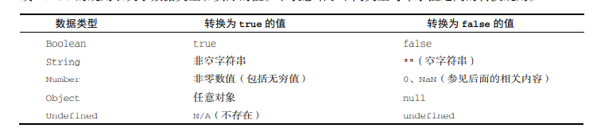

# JavaScript

与css相同，可以写在HTML中，也可以写在外部链接起来

```javascript
<!DOCTYPE html>
<html lang="en">
<head>
    <meta charset="UTF-8">
    <title>Title</title>
</head>
<script>
    alert('hello,world!');
</script>
<body>

</body>
</html>
```


链接方式： 使用script src=

```javascript
<!DOCTYPE html>
<html lang="en">
<head>
    <meta charset="UTF-8">
    <title>Title</title>
    <script src="a.js"></script>
</head>
<!--<script>-->
<!--    alert('hello,world!');-->
<!--</script>-->
<body>

</body>
</html>
```


```Javascript
alert('hello,world!')
```


# 基本语法

## var 

```JavaScript
<!DOCTYPE html>
<html lang="en">
<head>
    <meta charset="UTF-8">
    <title>Title</title>
    <script>
        // 使用var 设置新变量
        var score=75;
        if(score>60 &&score<=70)
        {
            alert('大于60 小于等于70')
        }else if(score>70 &&score<=80)
        {
            alert('大于70小于等于80')
        }
        else
            {
            alert('other')
        }
    </script>
</head>
<body>

</body>
</html>
```


调试在浏览器中调试


可以进行断点测试


在控制台也可以使用弹出窗口弹出 score


也可以使用 console.log(score)在控制台中打印出score的值


## es6 新增let 

### let与var使用方式差不多，但是仍有区别

#### 1.var 声明的范围是函数作用域， let声明的范围是块作用域

```js
    <script>
        function test(){
    if(true){
        let name = 'bob'
    console.log(name,1)
    }
    console.log(name,2)

    if(true){
        var name1 = 'cob'
    console.log(name1,1)

    }
    console.log(name1,2)
 }

 test()
 
    </script>
```


同样在if块中声明name和name1，let 声明的name只在if这个区块中生效，但是var声明的name1 在整个test()函数作用域都生效

#### 2.let 不允许冗余声明

即同一个变量不能声明多次：

```js
var name;
var name;  // 正常

let age; 
let age;  //报错，已经被声明过  Uncaught SyntaxError: Identifier 'age' has already been declared
```

#### 3. let声明不会提升

```js
console.log(name);  // undefined
console.log(age);  // 报错，没有定义age
var name ='bob';
console.log(name); // 'bob'
let age =18
console.log(age);  //18
```

let声明的age不会提升，所以会出现第二个console的结果，在let声明age之前，执行的瞬间被称为暂时性死区，在此阶段，使用任何后面声明的变量都会报错，

var 声明的name被提升到了最上面，但是没有值，上面var声明的name等同于：

```js
var name 
console.log(name);
name = 'bob'
```

#### 4.let 声明的变量不会成为window对象

```js
var name = 'Matt'; 
console.log(window.name); // 'Matt' 
let age = 26; 
console.log(window.age); // undefined 
```

## es6新增const

与let基本相同，唯一区别是声明时必须初始化变量，而且尝试修改const声明的变量会导致运行错误，常用来定义常量，或者是对象，可以改变对象里面的值


# 七种数据类型

六种简单数据类型 Null ， String ， Number，Undefined，Boolean ， Symbol，一种复杂数据类型Object

## typeof 操作符

用于确定变量的数据类型，不是函数，不需要传参但是可以传参：

```js
let name = 'bob', age = 18  
console.log(typeof name)  // string 
console.log(typeof(name))  //string
console.log(typeof age)  // number
console.log(typeof null) // object
```

## 1.undefined

undefined类型只有一个特殊值undefined，当变量被声明，但是没有复制的时候，就是相当于给变量赋值undefined

## 2.null

与undefined相同只有一个特殊值null，逻辑上讲null表示一个空对象指针，这也是给 typeof 传一个 null 会返回"object"的原因。 在定义将来要保存对象的变量时，建议使用null来初始化

## 3.Boolean

两个值： true和false  , 虽然只有两个，但是其他类型的值可以通过Boolean()转型函数转换为布尔值



## 4.Number 

### js不区分小数和整数统一用number表示

```javascript
123// 整数
123.123// 小数
1.23e4// 科学计数法  
-123 // 负数
NAN // not a number 不是一个数
Infinity // 无穷大的数
-Infinity  // 无穷小的数
```

###  值的范围

```js
console.log(Number.MAX_VALUE)  // 1.7976931348623157e+308
console.log(Number.MIN_VALUE)  // 5e-324
```

当计算出的值超出这个范围后，获得的值会自动转换为Infinity或-Infinity

### 进制

##### 

```js
057    // 47  8进制以0开头
0x1f   // 31  16进制以0x开头
```


### 浮点值

要定义浮点值，必须包含小数点且小数点后面必须至少有一个数字。

### NaN

not a number 不是一个数值，用于表示本来要返回数值的操作失败了（不是抛出错误）

```js
 console.log(-0)  // -0  
 console.log(-0/0)  //NaN
 console.log(0/0)  //NaN
 console.log(NaN==NaN) // false
```

#### 1.涉及到NaN的操作始终返回NaN

#### 2.NaN不等于包括自身在内的任何值

可使用isNaN()函数来判断

```js
 console.log(isNaN(NaN))  //ture
    console.log(isNaN(10)) //false
    console.log(isNaN('10')) //false
```

### 数值转换

#### Number()

规则： 

1.布尔值，ture 转换为1 ， false转换为0

2.数值直接返回

3.null，返回0

4.undefined返回NaN

5.字符串： 

（1）字符串带数值字符，包括前面带加减符号的，转换为十进制数值

（2）包含有效浮点格式的，转换为浮点值

（3）包含有效十六进制格式的。转换为对应的十进制整数值

（4）空字符串返回0

（5）其他情况返回NaN

6.对象，调用valueOf() 方法，按照上述规则转换返回的值，如果结果是NaN，调用toString()，在按照字符串的规则转换

```js
 console.log(Number(true))   //1  
 console.log(Number(false))   //0
 console.log(Number(10))   //10  
 console.log(Number(010))   //8
 console.log(Number(0x1f))    //31
 console.log(Number(null))   //0
 console.log(Number(undefined))  //NaN  
 console.log(Number('hello'))    //NaN
 console.log(Number(''))    //0
 console.log(Number('0x1f'))    //31
 console.log(Number('010'))    //10 
 console.log(Number('10'))    //10 
 console.log(Number('00.10'))    //0.1
 console.log(Number('00.10.1'))    //NaN
```

#### parseInt()

考虑到用 Number()函数转换字符串时相对复杂且有点反常规，通常在需要得到整数时可以优先使 用 parseInt()函数。parseInt()函数更专注于字符串是否包含数值模式。字符串最前面的空格会被 忽略，从第一个非空格字符开始转换。如果第一个字符不是数值字符、加号或减号，parseInt()立即返回 NaN。如果第一个字符是数值字符，加号或减号，parseInt会继续依次检测每个字符，直到字符串末尾，或者碰到非数值的字符（小数点不是有效的整数字符）,同时，可接受第二个参数，用于指定进制数。

```js
  console.log(parseInt('0x1f',16))     // 31 
    console.log(parseInt(22.5))   // 22
    console.log(parseInt("123baf"))   // 123
```

如果不传第二个参数，相当于让parseInt()自己决定如何解析，所以为了避免出错，建议始终传第二个参数

#### parseFloat()

工作方式与parseInt()函数类似，都是从0开始检测每个字符，解析到字符串末尾或者解析到一个无效的浮点数值字符为止，即第一个小数点是有效的，第二次出现的小数点就无效了。与parseInt不同的是，parseFloat只能解析十进制，十六进制始的字符串终返回0，所以不能指定底数（第二个参数），如果字符串表示的是整数（无小数点/小数点后只有0）则parseFloat()返回整数。

```js
console.log(parseFloat("0x1f"))   //0 
console.log(parseFloat('0000054.00'))   //54 
console.log(parseFloat(12.2))   //12.2 
console.log(parseFloat(0x1f))   //31
```


## 5.字符串

String（字符串）数据类型表示零或多个 16 位 Unicode 字符序列。字符串可以使用双引号（"）、 单引号（'）或反引号（`）标示

特点：一旦被创建，则值无法改变，要想修改某个变量中的字符串数值，必须先销毁原始的字符串，然后将包含新值的另一个字符串保存到该变量

let lang = "Java";  lang = lang + "Script";  这里，变量 lang 一开始包含字符串"Java"。紧接着，lang 被重新定义为包含"Java"和"Script" 的组合，也就是"JavaScript"。整个过程首先会分配一个足够容纳 10 个字符的空间，然后填充上 "Java"和"Script"。最后销毁原始的字符串"Java"和字符串"Script"，因为这两个字符串都没有用 了。所有处理都是在后台发生的，而这也是一些早期的浏览器（如 Firefox 1.0 之前的版本和 IE6.0）在 拼接字符串时非常慢的原因。这些浏览器在后来的版本中都有针对性地解决了这个问题

### 转义为字符串

几乎所有值(null，undefined没有)都有toString()方法（唯一用途：返回当前值的字符串等价物）,

```js
let a = 12
let b =a.toString()
console.log(typeof b)  //string
```

一般来讲toString()不接收任何参数，不过对数值调用该方法时，可以接受一个底数参数来输出对应的进制数(传10与不传结果相同)：

```js
let num = 10; 
console.log(num.toString()); // "10" 
console.log(num.toString(2)); // "1010" 
console.log(num.toString(8)); // "12" 
console.log(num.toString(10)); // "10" 
console.log(num.toString(16)); // "a"
```

转义字符:

```js
\'    '
\n    换行
\t    tab
\u4e2d    "中"   unicode字符  格式为\u####
\41    ascll 字符
```


### 模板字面量

使用``包裹，保留换行字符，可跨行定义字符串

```js
let a  = `first 
second`
let b = 'first\nsecond'
let c = 'first second'
console.log(a)
console.log(b)
console.log(c)
```


可以用来定义模板

```js
let pageHTML = ` 
<div> 
 <a href="#"> 
 <span>Jake</span> 
 </a> 
</div>`; 

```

由于模板字面量会保持反引号内部的空格。格式正确的模板字符串看起 来可能会缩进不当

```js
// 这个模板字面量在换行符之后有 25 个空格符
let myTemplateLiteral = `first line 
 second line`; 
console.log(myTemplateLiteral.length); // 47 
// 这个模板字面量以一个换行符开头
let secondTemplateLiteral = ` 
first line 
second line`; 
console.log(secondTemplateLiteral[0] === '\n'); // true 
// 这个模板字面量没有意料之外的字符
let thirdTemplateLiteral = `first line 
second line`; 
console.log(thirdTemplateLiteral); 
// first line 
// second line 
```

### 字符串插值

模板字面量是一种特殊的js句法表达式，只不过求值后的得到的是字符串，模板字面量在定义的时候立即求值并且转换为字符串实例，任何插入的变量也会从它们最接近的作用域中取值

插值使用${}

```js
let a = 5 
let b = `${a} to the second power is ${a*a}`  
console.log(b)    //5 to the second power is 25
```

所有插入的值都会使用toString()强制转型为字符串，任何js表达式都可以用于插值。签到的模板字符串无须转义，插值表达式中也可以调用函数和方法，也可以插入自己之前的值

```js
function capitalize(word) { 
 return `${ word[0].toUpperCase() }${ word.slice(1) }`; 
}     // 将传入的值首字母大写
console.log(`${ capitalize('hello') }, ${ capitalize('world') }!`); // Hello, World! 


let a  =  ''
function add(){
    a = `${a}abc1`    //将自己插入
  console.log(a)  
}
add()  //abc1
add()  //abc1abc1
add()   // abc1abc1abc1
add()  //abc1abc1abc1abc1
```

### 模板字面量标签函数

标签函数第一个值，接收的是插值两边的字符，并且将其存入数组，后面接收的值对应的是每个插值

```js
function foo(strings){
console.log(strings)
}
foo`${a}`     // ['','']
foo`aa${a}`   // ['aa','']
foo`${a}bb`   // ['','bb']
foo`aa${a}bb` // ['aa','bb'] 


```

```js
let a = 1
let b = 2
function foo(strings, aval,bval){
    console.log(strings)  // ['aa','+','bb']
    console.log(aval)   //1
    console.log(bval)  //2
}
foo`aa${a}+${b}bb`
```

上面方法也可以写为：

```js
function foo(strings,...arg){
console.log(strings)  // ['aa','+','bb']
console.log(arg)      // [1,2]
}
```

### 原始字符

使用默认的String.raw标签函数可以直接获取原始的模板字面量内容，而不是转换后的字符表示

```js
console.log(`\u00A9`)   // ©
console.log(String.raw`\u00A9`)   // \u00A9

console.log(`first \n second`)  //   first
                                //  second
console.log(String.raw`first \n second`)  //   first \n second

// 对实际的换行符没有效果
console.log(String.raw`first 
second`)                       //  first
                                //  second
```

## 6.Symbol

符号是原始值，符号实例是唯一，不可变的

### 使用方法

使用Symbol()函数初始化

```js
 let a = Symbol()
 console.log(a)          //Symbol()
 console.log(typeof a)    // symbol
 let b = Symbol('c')     //传入的字符串是对这个符号的描述，后续可以通过这个字符串来调试代码，但是这个字符串参数与符号定义或标识完全无关
 console.log(b)          //Symbol(c)
 console.log(typeof b)    // symbol
```

```js
let genericSymbol = Symbol(); 
let otherGenericSymbol = Symbol(); 
let fooSymbol = Symbol('foo'); 
let otherFooSymbol = Symbol('foo'); 
console.log(genericSymbol == otherGenericSymbol); // false 
console.log(fooSymbol == otherFooSymbol);  // false 
```

Symbol()函数不能与new关键字一起作为构造函数使用。这样是为了避免创建符号包装对象。像使用 Boolean、String 或 Number 那样，它们都支持构造函数且可用于初始化包含原始值的包装对象，

```js
let myBoolean = new Boolean(); 
console.log(typeof myBoolean); // "object" 
let myString = new String(); 
console.log(typeof myString); // "object" 
let myNumber = new Number(); 
console.log(typeof myNumber); // "object" 
let mySymbol = new Symbol(); // TypeError: Symbol is not a constructor 
```

如果一定要使用符号包裹对象，可以使用Object()函数

```js
let mySymbol = Symbol(); 
let myWrappedSymbol = Object(mySymbol); 
console.log(typeof myWrappedSymbol); // "object" 
```

### 全局符号注册表

符号实例是唯一的，如果运行时的不同部分需要共享和重用符号实例，可以用一个字符串作为键（定义符号时传入的字符串），在全局符号注册表中创建并重用符号

```js
let a = Symbol('a')
let a1 = Symbol('a')
console.log(a==a1)   //false

//使用Symbol.for将符号实例添加的注册表
let a =Symbol.for('a')
let a1 =Symbol.for('a')
console.log(a==a1)   //true

//使用Symbol.keyFor 可以查询符号在全局注册表中的字符串键
let b = Symbol()
console.log(Symbol.keyFor(a1))   //a 
console.log(Symbol.keyFor(a))  //a
console.log(Symbol.keyFor(b))  //undefined 不在全局注册表中，返回undefined

```

### 符号作为属性使用

所有字符串和数值可以作为属性的地方都可以使用符号。

```js
let s1 = Symbol('foo'), 
 s2 = Symbol('bar'), 
 s3 = Symbol('baz'), 
 s4 = Symbol('qux'); 
let o = { 
 [s1]: 'foo val' ,
 [s2] :'bar val'
}; 
```


也可以写为

```js
let o ={}
o[s1] = 'foo val';
o[s2] = 'bar val'
```


```js
Object.defineProperty(o,s3,{value:'baz'})
Object.defineProperties(o,{[s4]:{value:'qux'},[s5]:{value:'fag'}})
```


```js

    let s1 = Symbol('foo'),
        s2 = Symbol('bar');
    let o = {
        [s1]: 'foo val',
        [s2]: 'bar val',
        baz: 'baz val',
        qux: 'qux val'
    };
    console.log(Object.getOwnPropertySymbols(o));    // 返回该对象里面的符号属性
    // [Symbol(foo), Symbol(bar)] 
    console.log(Object.getOwnPropertyNames(o));     //返回该对象里面的常规属性
    // ["baz", "qux"] 
    console.log(Object.getOwnPropertyDescriptors(o));  //返回所有属性
    // {baz: {...}, qux: {...}, Symbol(foo): {...}, Symbol(bar): {...}} 
    console.log(Reflect.ownKeys(o));    // 返回所有属性的key
// ["baz", "qux", Symbol(foo), Symbol(bar)] 

```

因为符号属性是对内存中符号的一个引用，所以直接创建并用作属性的符号不会丢失。但是，如果 没有显式地保存对这些属性的引用，那么必须遍历对象的所有符号属性才能找到相应的属性键

```js
et o = { 
 [Symbol('foo')]: 'foo val', 
 [Symbol('bar')]: 'bar val' 
}; 
console.log(o); 
// {Symbol(foo): "foo val", Symbol(bar): "bar val"} 
let barSymbol = Object.getOwnPropertySymbols(o) 
 .find((symbol) => symbol.toString().match(/bar/)); 
console.log(barSymbol); 
// Symbol(bar) 
```

## 7.Object 

数据和功能的集合，通过new操作符后跟对象类型的名称来创建。

```js
let  o  = new object()
```

### 每个Object实例都有如下属性和方法

#### 1.constructor

用于创建当前对象的函数

let  o  = new object()中，这个属性的值就是Object()函数

#### 2.hasOwnProperty(propertyName)

用于判断当前对象实例上是否存在给定的属性，传入的参数必须是字符串（如 o.hasOwnProperty("name")）或符号

#### 3.isPrototypeOf（object）

用于判断当前对象是否是另一个对象的原型

#### 4.propertyIsEnumerable(propertyName)

判断给定的属性是否可以使用for-in语句枚举

#### 5.toLocaleString()

返回对象的字符串表示，该字符串反映对象所在的本地化执行环境

#### 6.toString()

返回对象的字符串表示

#### 7.valueOf()

返回对象对印的字符串，数值或布尔值表示。通常与toString()的返回值相同。

# 操作符

  ECMA-262 描述了一组可用于操作数据值的操作符，包括数学操作符(加减乘除)，关系操作符和相加操作符等。ECMAScript 中的操作符是独特的，因为它们可用于各种值，包括字符串、 数值、布尔值，甚至还有对象。在应用给对象时，操作符通常会调用 valueOf()和/或 toString()方 法来取得可以计算的值。

## 一元操作符

ECMAScript中最简单的操作符，只操作一个值。

### 1.递增/递减操作符

分为两个版本，前缀版和后缀版。

前缀版： --a  ,  ++a     先改变a的值在进行后续操作

```js
let a = 2
let b = 3 
let  c = --a +b;  
let d = a + b    
console.log(c)   // 4 
console.log(d)   // 4
```

后缀版：a--  , a++       先操作再改变a的值

```js
let a = 2
let b = 3 
let  c = a-- + b;  
let d = a + b    
console.log(c)   // 5 
console.log(d)   // 4
```

递增递减操作符可以作用于字符串，布尔值，浮点值，甚至对象都可以。遵循如下规则：

1.字符串，如果是有效的数值形式，这转换为数值再应用改变。变量类型从字符串变成数值

```js
let a = '123'
console.log(++a)    // 124
console.log(typeof ++a) // number
```

2.字符串，如果不是有效数值形式，则将变量的值设置为NaN。变量类型从字符串变成数值

```js
let a = 'abc'
console.log(++a)    // NaN
console.log(typeof ++a) // number 
```

3.布尔值，如果是false,则转换为0，如果是true，则转换为1，再应用改变，变量类型从布尔值变成数值。

```js
let a = false;
let b =true;
console.log(++a)  //1
console.log(++b)  //2
console.log(typeof ++a)  //number 
console.log(typeof ++b)  //number
```

4.浮点值，加一减一

5.对象，先调用valueOf()方法取得可以操作的值。对得到的值应用上述规则。如果是NaN，这调用toString()并再次应用其他规则，变量类型从对象变成数值。

### 2.一元加减

一般用于基本的算术，但也可以用于数据类型转换。

  不会影响数值，如果应用一元加到非数值，则会执行与使用Number()转型函数一样的类型转换：布尔值false转0，true转1，字符串根据特殊规则进行解析，对象会调用它们的valueOf()和/或toString()方法得到可以转换的值

```js
let s1 = "01"; 
let s2 = "1.1"; 
let s3 = "z"; 
let b = false; 
let f = 1.1; 
let o = { 
 valueOf() { 
 return -1; 
 } 
}; 
s1 = +s1; // 值变成数值 1 
s2 = +s2; // 值变成数值 1.1 
s3 = +s3; // 值变成 NaN 
b = +b; // 值变成数值 0 
f = +f; // 不变，还是 1.1 
o = +o; // 值变成数值-1
```

一元减主要用于吧数值变成负值，应用到非数值时，会遵循于一元加一样的规则，先转换，再取负值

```js
let s1 = "01"; 
let s2 = "1.1"; 
let s3 = "z"; 
let b = false; 
let f = 1.1; 
let o = { 
 valueOf() { 
 return -1; 
 } 
}; 
s1 = -s1; // 值变成数值-1 
s2 = -s2; // 值变成数值-1.1 
s3 = -s3; // 值变成 NaN 
b = -b; // 值变成数值 0 
f = -f; // 变成-1.1 
o = -o; // 值变成数值 1 
```

### 3.位操作符

ECMAScript中的所有数值都以IEEE 754 64位格式存储，但位操作并不直接应用到64位表示，而是先把值转换为32位整数，再进行位操作，之后再把结果转为64位。

有符号整数使用32位的前31位表示整数值，第32位称为符号位，表示符号，0为正，1位负。它的值决定了数值其余部分的格式，正值以真正的二进制格式存储。例如18的二进制格式为00000000000000000000000000010010，精简为10010


负值以一种称为二补数(或补码)的二进制编码存储。一个数值的二补数通过3步计算得到：

1.确定绝对值的二进制表示

2.反码（0变1,1变0）

3.结果加1

例如 -18， 先找到18的二进制0000 0000 0000 0000 0000 0000 0001 0010，然后计算补码：1111 1111 1111 1111 1111 1111 1110 1101 

最后给补码加1得到：11111111111111111111111111101110。

在处理有符号整数时，我们无法访问第31位，ECMAScript会记录这些信息，把负值输出位二进制字符串时，我们会得到一个前面加了减号的绝对值

```js
let a = -18;
console.log(a.toString(2)) // -10010
```

在对 ECMAScript 中的数值应用位操作符时，后台会发生转换：64 位数值会转换为 32 位数值，然 后执行位操作，最后再把结果从 32 位转换为 64 位存储起来。整个过程就像处理 32 位数值一样，这让二进制操作变得与其他语言中类似。但这个转换也导致了一个奇特的副作用，即特殊值NaN 和Infinity 在位操作中都会被当成 0 处理。 如果将位操作符应用到非数值，那么首先会使用 Number()函数将该值转换为数值（这个过程是自动的），然后再应用位操作。最终结果是数值。

#### 按位非

符号： ~

作用：返回数值的一补数（补码）

```js
let num1 = 25; // 二进制 00000000000000000000000000011001 
let num2 = ~num1; // 二进制 11111111111111111111111111100110 
console.log(num2); // -26 
```

按位非的最终效果是对数值取反并减1,与下面操作一样

```js
let num1 = 25; 
let num2 = -num1 - 1; 
console.log(num2); // "-26" 
```

结果相同但是位操作在数值底层表示上完成的原因，速度会快的多。

#### 按位与

符号：&

本质上，按位与就是将两个数的每一个位对齐， 然后基于真值表中的规则，对每一位执行相应的与操作，同为1时结果才为1，其他情况结果都是0.

```js
let a =25
let b =3 
let result= a&b
console.log(result)   //1
```


#### 按位或

符号： |

本质上，按位与就是将两个数的每一个位对齐， 然后基于真值表中的规则，对每一位执行相应的与操作，至少一位是1时返回1，两位都是0是返回0

```js
let a =25
let b =3 
let result= a|b
console.log(result)   //27
```


#### 按位异或

符号：^

只有两位不同时（一位是1一位是0）才返回1，其余情况返回0

```js
let a =25
let b =3 
let result= a^b
console.log(result)   //26
```


#### 左移

符号：<<

按照指定的位数将数值的所有位向左移动，右端空出来的位数由0填充。左移时会保留符号。

```js
let a = 2;
let b = a <<5
console.log(a.toString(2))   //10
console.log(b.toString(2))   //1000000
console.log(b)              //64
```

#### 右移

符号：>>

按照指定的位数将数值的所有位向左移动，符号位不动，符号位后面空出来的位数由0填充

```js
let a = 64 
let b = a>>5
console.log(a.toString(2))   //1000000
console.log(b.toString(2))   //10
console.log(b)              //2
```

#### 无符号右移

符号： >>>

将数值的所有32位右移，对于正数，无符号右移与由符号右移结果相同，对于负数，差异会很大，无符号右移操作符将负数的二进制表示当成正数的二进制表示来处理。因为负数是其绝对值的二补数，所以右移之后结果变 得非常之大

### 4.布尔操作符

#### 逻辑非

符号： ！

可以应用给ECMAScript中的任何值。无论是什么数据类型，该操作符会先将操作数转换为布尔值，再取反，这个操作符始终返回的是布尔值。使用两个！！可以将任意值转换为布尔值，第一个！将总会返回布尔值，第二个！将返回的布尔值取反以得到该值对应真正的布尔值。结果使用Boolean()函数是一样的。

规则：

1.操作数是对象，返回false

2.空字符串，返回true

3.非空字符串，返回false

4.数值0，返回true

5.非0数值，包括Infinity，返回false

6.null，返回true

7.NaN，返回true

8.undefined，返回true

#### 逻辑与

符号：&&

同为真时，才返回真。短路特性：但第一个操作数是false时，后面的操作数不会判断

同样逻辑与可以用于任何类型的操作数，规则如下

1.如果第一个操作数是对象，返回第二个

```js
let a ={}
let b = 1 
let result =a && b
console.log(result)  // 1
```

2.如果第二个操作数是对象，只有当第一个值是true时，才会返回第二个值，如果第一个值是false，直接返回false

```js
let a = true;
let b = {}
let c = false;
let result1 = a && b
let result2 = c && b

console.log(result1)  // {}
console.log(result2)  // false
```

3.如果两个操作数都是对象，则返回第二个操作数

```js
let a = {name:'a'},b={name:'b'}
console.log(a&&b)   // {name:'b'}
```

4.有一个操作数是null，NaN，undefined,直接返回null，NaN，undefined。

```js
console.log(undefined&&true)    // undefined
console.log(null&&true)    //null
console.log(NaN&&true)   //NaN
```

#### 逻辑或

符号: ||

有一个值为真时，返回真，同样具有短路特性，当第一个值为true时，不会去判断第二个值

同样逻辑或可以用于任何类型的操作数，规则如下

1.如果第一个操作数是对象，返回第一个操作数

```js
console.log({}||1)  // {}
```

2.如果第一个操作数为false，返回第二个操作数

```js
console.log(false||1)   //1
```

3.如果两个操作数都是null，NaN，undefined则返回null，NaN，undefined。

```js
console.log(undefined||undefined)  //undefined
console.log(null||null)   //null
console.log(NaN||NaN) //NaN
```

### 5.乘性操作符

ECMAScript 定义了 3 个乘性操作符：乘法、除法和取模。在处理非数值时，会自动将类型转换为数值，

#### 乘法操作符

符号：*

规则：

1.如果操作数都是数值，执行常规的乘法运算，如果得到的数超出范围，返回Infinity或者-Infinity

2.操作数中有NaN，返回NaN

3.Infinity乘以0，返回NaN

4.Infinity乘以非0的有限数值，根据第二个操作数的符号返回Infinity或者-Infinity。

5.Infinity 乘以 Infinity，则返回 Infinity

6.如果有不是数值的操作数，则先在后台用 Number()将其转换为数值，然后再应用上述规则。

#### 除法操作符

符号： / 

规则：

1.操作数都是数值，执行常规的除法运算

2.操作数中有NaN，返回NaN

3.如果是 Infinity 除以 Infinity，则返回 NaN

4.如果是 0 除以 0，则返回 NaN。

5.如果是非 0 的有限值除以 0，则根据第一个操作数的符号返回 Infinity 或-Infinity。

6.如果是 Infinity 除以任何数值，则根据第二个操作数的符号返回 Infinity 或-Infinity。

7.如果有不是数值的操作数，则先在后台用 Number()函数将其转换为数值，然后再应用上述规则。

#### 取模（取余）运算符

符号：%

规则：

1.操作数都是数值，执行常规除法运算，返回余数

2.被除数是Infinity，返回NaN

3.被除数是有限值，但除数是0，返回NaN

4.如果被除数是有限值，除数是无限值，则返回被除数。

5.如果被除数是 0，除数不是 0，则返回 0

6.如果有不是数值的操作数，则先在后台用 Number()函数将其转换为数值，然后再应用上述规则。

### 6.指数操作符

#### 比较运算符

= 赋值

== 等于 （类型不一样，值一样，也会判断为TRUE）

===绝对等于 类型一样，值一样 才为TRUE

在js中要使用===来比较


#### 数组

Java中的数组必须要是相同类型的一系列对象，但是在js中 因为创建对象的只有var ，所以可以整花的

数组使用中括号

```JavaScript
<script>
     var arr=[1,2,3,4,'null','hello']
</script>
```


# 严格检查模式

  'use strict'

预防js的随意性导致的一些问题,必须放在第一行

```JavaScript
<script>
    'use strict'
   i=1;
</script>
```


局部变量使用let创建，使用 let 后就不会有报错了


## 数组

可以包含任意的数据类型

```javascript
var arr=[1,2,3,4,5,6]// 通过下标取值和赋值
arr[1]
arr[1=0]
```


length数组长度，也可以设置比原始长度短，但是这样会丢失元素

### indexof

通过元素获得下标索引


arr数组中，元素为5的下标是4

## slice

数组中的substring,截取数组的一部分返回一个新数组


同样是包头不包尾

## push   pop 尾部

push 压入到尾部


pop 弹出尾部


## unshift  shift 头部

unshift 压入到头部


shift 弹出尾部


## 打印 数组的值

使用 for in 打印数组的下标

```js 
var arr =[50,51,52];
for (var x in arr)
    {
         console.log(x);
    }
```


使用for of 打印数组的值

```js
var arry= [50,51,52];
for(var x of arry){
    console.log(x);
}
```


## 排序 sort


## 元素翻转 reverse


## 数组连接 concat


使用concat后并不会改变arr数组，但会返回一个新数组，可以用arr2接受新数组

##  连接符join

打印拼接数组，使用特定的符号连接


## 多维数组

```javascript
arr=[[0,0],[0,1],[1,1],["1","1"]]
```


# 对象

1.格式： 对象={属性：“属性值”，属性：“属性值”，属性：“属性值，属性：“属性值”}

最后一个属性后面不加逗号

```javascript
var person={
    name:"dudu",
    age:"3",
    tags: [ 'js','java','web']
}
```


2.可以直接添加属性和删除属性

添加：直接定义


删除： 使用delete  对象.属性


3.js中所有的键都是字符串，值是任意对象

就当成每个对象都是一个数组吧


4.判断一个属性是不是在这个对象中 

使用in


这里 toString在父级中

5.判断一个属性是不是被这个对象自身拥有

使用hasOwnPorperty（）


# 流程控制

三个循环一样使用

 

# ES6新特性

map

```js
var map= new Map([['tom',100],['jerry',90],['jack',80]]); // 使用map创建了一个分数数组
var name=map.get('tom') ;//使用.get 用名称来查询分数
console.log(name);
map.set('haha',70) ;// 使用set添加 haha的分数
map.delete（’jack‘）; //使用delete删除jack的分数
```


set 一个不重复的数组，重复的部分会删除

```js
var set = new 'Set([1,2,2,2,2,3,4,4]); // 使用set 定义了一个数组
set.add（5）;  // 使用add往数组里面添加
set.delete(4)  // 与map相同使用delete删除
console.log(set.has(2)); // 使用has来判断这个元素是否在set数组中

```


#### 遍历map

```js
var map = new Map([['tom',100],['jerry',90],['jack',80]]);
for (let i of map){
    console.log(i);
}
```


#### 遍历set

```js
var set = new Set([1,2,3,3,3,3,4,5]);
for (let i of set)
{
    console.log(i);
}
```


# 函数

## 定义函数  使用function

第一种方法：

```js
function abs(x){
     if (typeof x!=="number"){
          throw'not a number' ;
         else if( x >=0 ){
           return x;
         }eles{
             return -x;
         }
     }
}
```

第二种方法 

function（）是一个匿名函数，将结果赋值给abs

````js
var abs= function(x){
    if(typeof x!=='number'){
        throw'not a number';
    }else if( x>=0){
        return x;
    } else {
        return -x;
    }
}
````

## 箭头函数

#### 写法：

```js
 (参数)=>{
     需要执行的代码
 }
```

#### 当大括号中代码数量多于一排时

```js
<script>
 const aaa= ()=> {
   console.log('haha');
   console.log('heihei');
   console.log('ohuo');
 }
 aaa()
</script>
```


#### 当大括号里面代码只有一行时

可以省略大括号

```js
const aaa= ()=>console.log('haha');
```


#### 当参数大于1时

```js
const num= (num1,num2)=> num1+num2;
console.log(num(2,3));
```


#### 当参数只有一个时

可以省略括号

```js
const mul = n => n*n;
console.log(mul(5));
```


## 箭头函数中的this指向

```js
<script>
    const aaa = function () {
        console.log(this+"1")
    }
    const bbb = () => {
        console.log(this+"2")
    }
    const obj = {
        name: "对象",
        ccc() {
            setTimeout(() => {
                setTimeout(function () {
                    console.log(this+"3")
                })

                setTimeout(() => {
                    console.log(this+"4")
                })
            })
            console.log(this+"5")
        },
    }
    aaa()
    bbb()
    obj.ccc()
</script>
```


function中的历史必定是指向window，而箭头函数中没有this，所以会一层一层的向上找有this的作用域，对于第5个this，在箭头函数中，所以想上一层作用域找this，即ccc（）中，而ccc的this指向obj 所以 第5个是obj  对于第四个this，在箭头函数中于是向上一层作用域找，仍然在箭头函数中，再向上一层找，找到了ccc（），而ccc的this指向obj 所以 第4个也是obj


## 方法调用

直接在控制台中使用


因为js 随意性 可以在abs后面输入很多值而不报错


虽然只用了一个值，但后面的值也可以用arguments 存在数组中。

```js
var abs= function(x) {
    if( typeof x!=="number"){
        throw'not a number';
}
    console.log("x="+x)
    for(let i= 0 ; i<arguments.length ;i++){
        console.log(arguments[i]);
    }
   if( x>=0){
        return x;
    } else {
        return -x;
    }
}
```


 不用遍历也可以直接取值

```js
var abs= function(x) {
    if( typeof x!=="number"){
        throw'not a number';
}
    console.log("x="+x)
     if (arguments.length>1){
         console.log(arguments[1])
     }
   if( x>=0){
        return x;
    } else {
        return -x;
    }
}
```


## rest

当输出多个值的时候，使用rest，可以将后面的值存至一个数组。  rest要放置最后 前面用...

```js
function abs(a,b,...rest) {
6
        console.log("a="+a);
        console.log("b="+b);
        console.log(rest);

}
```


 除了前面两个1 后面的所有值被放入了一个数组

# 变量的作用域

在js中var 定义的变量是有作用域的。

1.假设在函数体内声明，则在函数体外不可使用（使用闭包可以实现）

```javascript
<script>
    'use strcit'
       function  jpq() {
           var x =1 ;
           x=x+1;
       }
       x=x+2;
</script>
```


这里 function外面的x=x+2; 报错


2.如果两个函数内部使用了相同的函数名，只要在函数内部，就不会冲突

```js
<script>
'use strcit'
function jpq() {
var x = 1;
x = x + 1;
}
function jjj() {
var x = 1;
x = x + 2;
}
</script>
```

只要在函数内部是不会报错的


3.内部函数可以访问外部函数，反之则不行

```js
function q() {
    var x=1 ;
    x=x+1;
    function f() {
        var y=1 ;
        y=y+x;

    }
    function w() {
        var z=1;
        z=z+y;   
    }

}
```

可以得到x 和y 的值 但是 z 调用不到y 所以z 会报错

4. 假设内部函数变量与外部函数变量重名

```
function q() {
   var x=1;
   function w() {
       var x='a';
       console.log('inner'+x)

   }

    console.log('outer'+ x)
    w()

}
q()
```


在js中，函数查找变量从自身函数开始由内向外查找，假设外部存在这个同名的函数变量，则内部函数会屏蔽掉外部函数变量 使用自己（就理解为近原则吧）


### 提升变量的作用域

```js
function q() {
     var x = "x" + y ;
    console.log( x)
var y='y';

}
q()
```


y的定义在x = "x"+y 后面，但是结果仍然打印出了x  但结果是 xundefined  说明js 自动将var y提到了前面 但是赋值没有提到前面

所有的函数变量最好放在函数头部，便于代码维护

### 全局对象 window

```js
 var x=1 ;
 alert(x);
alert(window.x);
```

这里会弹出两个相同的窗口 说明 x 和window.x 是一样的性质。 默认所有的全局变量都会自动绑定在window对象下。


同样，函数也一样 默认绑定在window对象下。

```js
alert("12345" )
window.alert("12345")
```


效果是一样的


## 规范

 由于所有的全局变量会绑定到window上，如果不同的js文件，使用了相同的全局变量就会冲突，如何减少冲突？

把自己的代码全部放入自己定义的唯一空间名字中，降低全局命名冲突的问题

```js
var yapp = {};
yapp.name = 'haha';
yapp.x = '1';
yapp.add = function (a, b) {
    return a + b;
} 
```

 和创建对象 后给对象添加属性一模一样


## 局部作用域

```js
function aaa() {
    for (var  i = 0; i <10 ; i++) {
        console.log(i)
    }
    console.log(i+1)
}
```


 这里输出了一个11，说明第二条log也生效了 这个i出了for循环。为了防止这种情况使用let代替var

更改后


i不能出for循环 所以最后一条报错

所以 建议用let定义局部变量

### 常量

**ES6 之前，用全部大写字母命名的变量就常量，它可以变，但不要动。**

```js
var PI='3.14';
console.log(PI);
 PI= '123';  // 可变
console.log(PI);
```


ES6**中引入了一个常量关键字**const

```js
const PI = '3.14'
console.log(PI);
PI = '1234'
console.log(PI);
```


使用const后 无法变值


# 方法

把函数放在对象中就变成了方法

对象里面只有两个东西 ： 属性和方法

```js
'use strict'
 var person = {
     name: 'haha',
     birth: 2020,
     age: function () {
         var now = new Date().getFullYear();
         return now - this.birth;
     }
 }
```


这里 age的方法也可以写在外面 对象里面就只用写一个函数名字

```js
function getage() {
    var now = new Date().getFullYear();
    return now - this.birth;
}
 var person = {
     name: 'haha',
     birth: 2020,
     age: getage
 }
```


这里使用getage（）会报错，因为this永远指向使用他的对象，使用getage（）this 指向的是window 而window中没有this.birth属性


#### apply在js中控制this指向


```js
<script>
   'use strict'
   function getage() {
       var now = new Date().getFullYear();
       return now - this.birth;
   }
    var person = {
        name: 'haha',
        birth: 2020,
        age: getage
    };
    var student = {
        name: 'haha',
        birth: 2000,
        age: getage
    };


</script>
```


# 内部对象

 标准对象

```js
typeof 123
"number"
typeof '123'
"string"
typeof true
"boolean"
typeof []
"object"
typeof {}
"object"
typeof NaN
"number"
typeof matchMedia
"function"
typeof undefined
"undefined"
```

## Date

 

```js
var now = new Date();
console.log(now)   // 获取现在时间
now.getFullYear(); // 年
now.getMonth();    // 月  
now.getDate();      // 日
now.getDay();     // 星期几
now.getHours();   // 时
now.getMinutes();  //分
now.getSeconds();  // 秒
now.getTime();    // 时间戳  全世界统一   意为 从1970.1.1 0:00:00 到现在的毫秒数
console.log(new  Date(1627306349790));   //  将时间戳转换为时间
now.toLocaleString() // 本机时间
```


**注意： 月份是从0~11   比如现在是7月 返回的数值是6**


# json

在JavaScript中一切皆为对象，任何js支持的类型都可以用json来表示

格式：

对象 都用{}

数组[]

所有的键值对 都是用key：value

```JavaScript
<script>
    'use strict'
    var user={
        name : 'HAHAH',
        age : '3',
        sex : '男'
    }
    var jsonUser = JSON.stringify(user) // 对象转换为josn字符串
    console.log(jsonUser)
    console.log(user)
    
</script>
```


```js
JSON.parse(jsonUser) //将json转换为对象  parse （解析）
JSON.parse('{"name":"HAHAH","age":"3","sex":"男"}')
```


## 面向对象


```JavaScript
<script>
    var student ={
        name :'haha',
        run : function () {
            console.log(this.name+ 'fly ....')
        }
    }
    var person={
         name : 'xiaoming'
    }
    person.__proto__= student; // 小明的原型是student 这样小明就可以使用 student中的方法了

</script>
```


# class继承

```js
//  首先定义一个学生的类
    class Student{
        constructor(name){
            this.name=name;
        }
        hello(){
            alert('hello'+this.name)
        }

   }
    class Xstudent extends Student {
        constructor(name,grade) {
            super(name);
            this.grade=grade;
        }
        myGrade(){
            alert(this.grade +"年级")
        }
    }
   var xiaoming = new Student("xiaoming");
    var xiaohong = new Student("xiaohong");
    var haha = new Xstudent("haha",2);
```

构造类后还可以用 extends关键字构建student的子类 这样在构造器中可以直接使用父类的方法

如： 这里创建了一个新的Xstudent对象 haha 

在Xstudent类中 没有hello方法，但是它的父类有这个方法 是可以用的


# 操作BOM对象

JavaScript 诞生就是为了让它在浏览器中运行

BOM ： 浏览器对象模型


#### window代表浏览器窗口

```javascript
window.innerHeight
422
window.outerHeight
824
window.innerWidth
1536
window.outerWidth
1536
window.alert(123)
```


#### Navigator   封装了浏览器的信息


大多数情况下不会使用  navigator 因为这些东西可以被人为修改，不建议使用这些属性来判断和编写代码

### screen

代表屏幕尺寸

## location （重要）

location 代表当前页面的URL信息

```javascr
host: "www.baidu.com"
href : "https://www.baidu.com"
protocol:"https:"
reload:f reload()  // 重新加载 ，刷新页面
location.assign('https://www.hao123.com')  跳转到指定网页
```


## document

document 代表当前的页面，HTML DOM文档树

```js
document.title
"百度一下，你就知道"
document.title="hahaha"
"hahaha"
```

**可以获得具体的文档树节点**

```JavaScript
<body>
<dl  id="app">
    <dt >qwer</dt>
    <dd>1</dd>
    <dd>2</dd>
    <dd>3</dd>
    <dd>4</dd>
</dl>
<script>
    var dl = document.getElementById('app')
</script>
</body>
```


#### **获取cookie**

document.cookie  这也可以用来劫持cookie 

服务器端可以设置 cookie： httpOnly  防止劫持


### history 

history 代表浏览器的历史记录

```js
history.back() // 后退
history.forword() //前进
```


# 操作DOM对象 （重点）

DOM: 文档对象模型

#### 核心

浏览器网页就是一个DOM树型结构

- 更新： 更新DOM节点

- 遍历： 得到所有DOM节点

- 删除： 删除一个DOM节点

- 添加： 添加一个DOM节点

  

## 获得DOM节点

要操作一个DOM节点 就必须先获得一个DOM节点

```js
<body>
<h1> 标题</h1>
<p id="p1"> p1 </p>
<p class="p2"> p2</p>

<script>
    'use strict'
    var h1 =document.getElementsByTagName('h1');
    var p1 =document.getElementById('p1');
    var p2 =document.getElementsByClassName('p2');
</script>
</body>
```


这里有bytagname（标签名）， byid， bycalssname 三种方式 ，对应css 选择器


```js
<div id="father">
    <h1> 标题</h1>
    <p id="p1"> p1 </p>
    <p class="p2"> p2</p>
</div>


<script>
    'use strict'
    var h1 =document.getElementsByTagName('h1');
    var p1 =document.getElementById('p1');
    var p2 =document.getElementsByClassName('p2');
    var father = document.getElementById('father')

</script>
    
    
```

使用father.children可以得到这个节点下面的所有节点


这些都是原生代码，之后会使用jQuery


## 更新DOM节点

前提是获得DOM节点

空div id属性是id1 通过document.getElementById 获得这个DOM节点 然后通过方法更新

```js
<div id="id1">

</div>


<script>
   var id1 =document.getElementById('id1')
    id.innerHTML='12345';
   id.style.color= 'red';
   
</script>
```


#### innerHTML与textContent区别


## 删除节点

步骤： 先找到要删除的父级节点，然后通过父级节点删除该节点

```js
<div id="father">
    <h1> 标题</h1>
    <p id="p1"> p1 </p>
    <p class="p2"> p2</p>
</div>


<script>
    'use strict'
    var h1 =document.getElementsByTagName('h1');
    var p1 =document.getElementById('p1');
    var p2 =document.getElementsByClassName('p2');
    var father = document.getElementById('father')
father.removeChild(p1);  // 删除p1
</script>
```


### 通过自己找父级节点

```JavaScript
<body>
<div id="father">
    <h1> 标题</h1>
    <p id="p1"> p1 </p>
    <p class="p2"> p2</p>
</div>


<script>
    'use strict'
    var self = document.getElementById('p1');
    var father = p1.parentElement;
</script>
```


还可以用father.children[n] 来删除父类下的子节点 （n 从0开始）

```js
father.removeChild(father.children[0])
```


第一个标题被删除了

### 注意： 删除是一个动态的过程

按照上面的三个元素 当第一个被删除后，后面的会补上，即第二个节点变成了第一个节点


# 插入和创建节点

当我们获得DOM节点后，如果这个节点是空的，那可以通过 innerHTML 添加内容，但是如果获得的这个DOM节点是有内容的，这样做会将原来的内容覆盖。

### 追加 append

对象： 已存在的节点

```js
<body>

<p id="js">javascript</p>
<div id="list">
<p id="se">javaSE</p>
<p id="ee">javaEE</p>
<p id="me">javaME</p>
</div>

<script>
    'use strict'
    var js = document.getElementById('js')
    var list= document.getElementById('list')
    
</script>

</body>
```


使用append


直接将第一个p标签移动到了list下

### 创建一个新的标签，实现插入

使用 createElement


```js
<body>
 <p id="js">javascript</p>
<div id="list">
    <p id="se">javaSE</p>
<p id="ee">javaEE</p>
<p id="me">javaME</p>
</div>

<script>
    'use strict'
var js = document.getElementById('js');
var list= document.getElementById('list');
var newp=document.createElement('p');  //创建一个p标签
var newh= document.createElement('hr'); // 创建一个hr 标签
newp.id="newp";    // 给这个p标签添加id属性
newh.id="newh"; // 给这个hr标签添加id属性
list.append(newp); // 将p标签追加到list下
list.appendChild(newh); // 将hr标签追加到list下
</script>
</body>
```


**append 与appendChild的区别**  : append 可以传多个节点或者字符串，没有返回值，会有兼容问题 appendChild则只能传一个节点，不支持传字符串

```js
list.append(newp,newh);// 与上面效果相同
```


或者合起来写，然后用next或者lastElementChild选中 


#### 还可以创建style标签或者script标签

```js
<body>

<p id="js">javascript</p>
<div id="list">
<p id="se">javaSE</p>
<p id="ee">javaEE</p>
<p id="me">javaME</p>
</div>


<script>
    'use strict'
    var js = document.getElementById('js');
    var list= document.getElementById('list');
    var newp=document.createElement('p');  //创建一个p标签
    var newh= document.createElement('hr'); // 创建一个hr 标签
    newp.id="newp";    // 给这个p标签添加id属性
    newh.id="newh"; // 给这个hr标签添加id属性
    list.append(newp,newh); // 将p标签追加到list下
    // list.appendChild(newh); // 将hr标签追加到list下

    var mystyle = document.createElement('style'); // 创建一个空的style标签
    mystyle.setAttribute('type','text/css');
    mystyle.innerHTML='body{background:red;}'   // 设置标签内容
    document.getElementsByTagName('head')[0].appendChild(mystyle);// 这里获得的head是一个数组，要把style放在里面要用[0]
</script>

</body>
```

**tagname 获取的是数组**


## 操作表单

- 文本框  text

- 下拉框 <select>

- 单选框 radio

- 多选框 checkbox

- 隐藏域 hidden

- 密码框 password

- 。。。

  

  表单的目的： 提交信息

  


```js
<form action="" method="post">  <!--action 提交目标 method 以哪种方式接收-->
    <p>
        <span>用户名</span> <input type="text" id="usename">
    </p>


    <script>
        var use=document.getElementById('usename')
    </script>
```


#### 单选框

```js
<p>
    <input type="radio" name="sex" value="man" id="boy"> 男
    <input type="radio" name="sex" value="woman" id="girl"> 女
</p>
<script>
    var use=document.getElementById('usename')
    var boy=document.getElementById('boy')
    var girl=document.getElementById('girl')
</script>
```

可以通过 checked来判断选了什么 或者控制选什么

当选中男时 


让boy.checked=false 可以让其取消选中


让girl.checked = true


## 按钮绑定事件

onclick （单击鼠标）

```js
<!DOCTYPE html>
<html lang="en">
<head>
    <meta charset="UTF-8">
    <title>Title</title>
    <script src="https://cdn.bootcss.com/blueimp-md5/2.10.0/js/md5.min.js">    // 导入md5方法
    </script>
</head>
<body>
<form action="#" method="post">
    <p><span>用户名</span> <input type="text" id="usename" required  name="un"> </p>
    <p><span>密码</span> <input type="password" id="password" required name="pw"> </p>
    <p><button type="submit"  onclick="a()">提交</button></p>   //  onclick 点击按钮时 触发 a（） 方法
</form>

<script>
    function a() {
        var un= document.getElementById('usename');
        var pw= document.getElementById('password');
        console.log(un.value);
        pw.value=md5(pw.value);  // 使用md5 加密后赋值给pw 
        console.log(md5.value);  
        return true;

    }
</script>
</body>
</html>
```


点击提交后，触发了绑定事件，pw 被使用md5加密了


## 表单绑定事件

onsubmit 

```js
<head>
    <meta charset="UTF-8">
    <title>Title</title>
    <script src="https://cdn.bootcss.com/blueimp-md5/2.10.0/js/md5.min.js" ></script>
</head>
<body>

<form action="#" method="post"  onsubmit="return a()">
    <p><span>用户名</span> <input type="text"  name="usename" id="us"></p>
    <p><span>密码</span>&nbsp;&nbsp;&nbsp;<input type="password" name="pass" id="pw"></p>
    <p><input type="submit"></p>

</form>

<script>
function a() {
var us =document.getElementById('us');
var pw =document.getElementById('pw');
    pw.value=md5(pw.value);
    return true; // 可以校验表单 true 允许提交 false 阻止提交
}
</script>
</body>
```

和上面按钮点击绑定差不多


## 校验表单数据

```js
<script>
    function a() {
        var pw = document.getElementById('pw');
        var md5pwd = document.getElementById('md5')

        md5pwd.value = md5(pw.value);


        var n = pw.value.length;
        if (n < 6) {
            alert('密码不足6位')
            return false;

        } else {
            return true;
        }

    }
</script>
```

当密码不足6位时弹窗提醒并且不能提交


# jQuery

jQuery库，里面存在大量的JavaScript函数

### 获取jQuery

1.可以用CDN jQuery直接导入

2.创建lib文件夹 拖入jQuery文件然后导入js

## 使用公式

$('选择器').事件(函数)

$('selector').action()


```js
<body>
<!--公式: $(selector).action()  选择器就是css 选择器
-->
<a href="" id="text_jQuery">点我</a>

<script>
    $('#text_jQuery').click(function () {
            alert('hello,jQuery')
        }
    )
</script>


</body>
```

点击a标签后


## 选择器

```js
<script>
    // 原生选择器
    document.getElementById()     // id
    document.getElementsByTagName()   // 标签
    document.getElementsByClassName()   // class
    // jQuery 选择器   css 选择器都能在这里使用
    $('p').click(); //  标签
    $('#id').click() ; // id
    $('.class').click(); // class  
</script>
```


## 事件

```js
// 当网页元素加载完毕后 响应事件
$(document).ready(function () {

})
```

上面代码一般缩写为：

```js
$(function(){
     
})
```


### 鼠标事件 

```js
<!DOCTYPE html>
<html lang="en">
<head>
    <meta charset="UTF-8">
    <title>Title</title>
    <script src="https://cdn.bootcdn.net/ajax/libs/jquery/3.6.0/jquery.js"></script>  // 导入jQuery
    <style>
        #move{
            height: 300px;
            width: 300px;
            border: 1px solid red ;
        }
    </style>
</head>
<body>
<!--要求： 获取鼠标的坐标-->
mouse: <span id="mouseMove"></span>
<div id="move">
    在这里移动鼠标试试
</div>

<script>
    // 当网页元素加载完毕后 响应事件
    // $(document).ready(function () {
    //
    // })

    $(function(){
        $('#move').mousemove(function (e) {
$('#mouseMove').text('x:'+e.pageX+'y:'+e.pageY)
        })
        }
    )
</script>
</body>
</html>
```


### 操作DOM

```js
<!DOCTYPE html>
     <html lang="en">
          <head>
          <meta charset="UTF-8">
               <title>Title</title>
<script src="lib/jquery-3.6.0.js"></script>  // 导入jQuery
</head>
<body>
     <ul id="text_ul">
          <li name="js">js</li>
<li name="java">java</li>
</ul>
<script>
     $('#text_ul li[name=js]').html('<strong>1234</strong>')// 使用属性选择器 选中第一个li 然后将其内容改为 粗体1234
$('#text_ul li[name=js]').css({'color':'blue','background':'red'})  // 属性选择器，使用css时 单个直接写属性，多个就用花括号
$('#text_ul li[name=java]').css('color','red')
</script>
</body>
</html>
```


显示（show）与隐藏（hide）

```js
$('#text_ul li[name=js]').hide();   // 隐藏这个元素   本质上是 display : none ;
```


```js
$('#text_ul li[name=js]').show();   // 显示这个元素
```


# 小技巧

1.如何巩固js 

看jQuery 源码 看游戏源码

2.巩固HTML，css （扒网站，修改看效果）


# 函数表达式和函数声明

函数声明：

function 函数名称（参数： 可选）{函数体}

函数表达式：

function 函数名称 （可选）（参数：可选）{函数体}

**如果没有声明了函数名称**，**则一定是函数表达式**

如果function被包含在一个函数体内，或者位于程序的最顶部，那它就是一个函数声明

```js
  function foo(){} // 声明，因为它是程序的一部分
  var bar = function foo(){}; // 表达式，因为它是赋值表达式的一部分

  new function bar(){}; // 表达式，因为它是new表达式

  (function(){
    function bar(){} // 声明，因为它是函数体的一部分
  })();
(function foo(){}); // 函数表达式：包含在分组操作符内
```

（）分组操作符，内部只能包含表达式

函数声明会在任何表达式被解析和求值之前先被解析和求值，所以即使放在最下面，在前面调用时也能使用

```
 alert(fn());

  function fn() {
    return 'Hello world!';
  }
```

弹出 Hello world！

函数声明的实际使用规则：

函数声明只能出线在程序或者函数体内，不能出现在Block（块）（{...}）中，例如 if ，for，while 语句中，因为 Block（块） 中只能包含Statement语句， 而不能包含函数声明这样的源元素。另一方面，仔细看一看规则也会发现，唯一可能让表达式出现在Block（块）中情形，就是让它作为表达式语句的一部分。但是，规范明确规定了表达式语句不能以关键字function开头。而这实际上就是说，函数表达式同样也不能出现在Statement语句或Block（块）中（因为Block（块）就是由Statement语句构成的）。


# ES6

## 数组的解构赋值

右边必须是可遍历的结构，不可遍历则报错

数组按照顺序解构：

```js
let [a,b,c] = [1,2,3];
a//1
b//2
c//3
```

```js
let [a,[b,c]] = [1,[2,3]]
a//1
b//2
c//3
let [a,,b] = [1,2,3]
a//1
b//3
let [a,...b] = [1,2,3]
a//1
b//[2,3]
let [a,b,...c]=['a']
a//a
b//undefined
c//[]
let [a,[b],c]=[1,[2,3],4]
a//1
b//2
c//4
```

如果解构不成功则结果为undefined

```js
let [a] = []
let [a,b] = [1]
```

两个结果都为undefined

#### 默认值

当一个数组成员严格等于undefined时，默认值才会生效

```js
let [x=1,y='b',z='c',g='g'] = ['a',undefined,null]
x//a
b//b
z//null
g//g
```

```js
let [x=1,y=x] = []
x//1
y//1
let [x=1,y=x] = [2]
x//2
y//2
let [x=1,y=x] = [1,2]
x//1
y//2
let [x=y,y=1] = []
报错
```

## 对象的解构赋值

对象属性没有次序，必须同名属性才能获取赋值

```js
let {b,a} = {a:'aaa',b:'bbb'}
a// aaa
b//bbb
let {a} = {b:'bbb'}
a//undefined
```

对象的解构赋值其实是下面形式的简写：

```js
let {a:a,b:b} = {a:'aaa',b:'bbb'}
a//aaa
b//bbb
```

那么对于对象不同名时，可以用下面方式解构

```js
let {c:a,d:b} ={a:'aaa',b:'bbb'}
c//aaa
d//bbb
```

### 方法赋值到变量

```js
//将math中对数，正弦，余弦的三个方法赋值给log，sin，cos
let {log,sin,cos} = Math;

const { log } = console
log('hello') // hello
```

### 嵌套对象

```js
let obj = {
     p: [
          'Hello',
          {y:'World'}
     ]
}
let {p,p:[x,{y}]} = obj
p//['Hello',{y:'World'}]
x//Hello
y//World
//第二个p是模式，不是变量，所以不会被赋值
```

